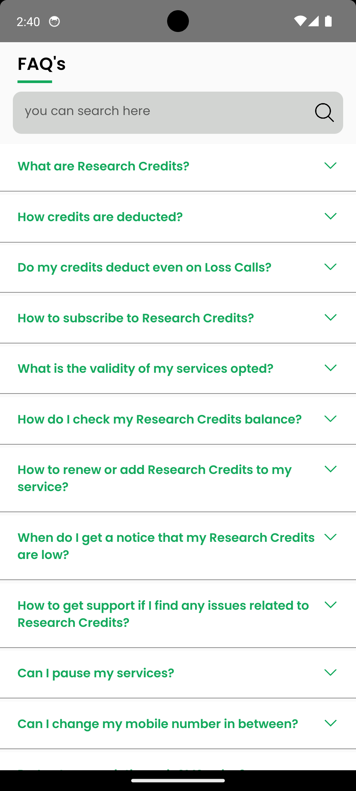
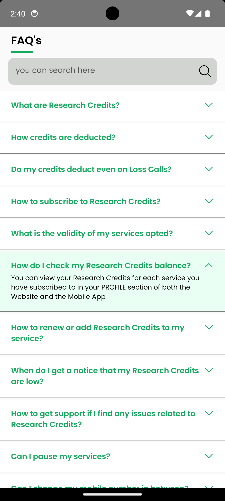
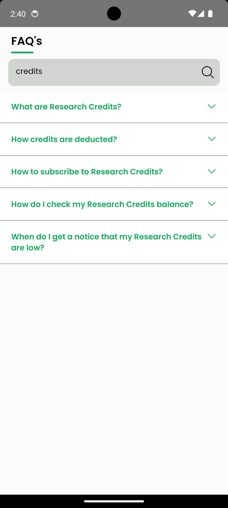

# React Native FAQ Library

This FAQ library was created to simplify the process of adding frequently asked questions to React Native applications. It aims to provide an easy-to-use and customizable solution for developers to enhance user experience by addressing common queries and concerns within the app.

The primary goals of this library include:
- Streamlining the integration of FAQs into React Native apps.
- Offering a user-friendly interface for managing and organizing questions and answers.
- Allowing developers to customize the FAQ component's appearance and behavior to match their app's design and requirements.

<table>
 <tr>
    <td>UI Interface</td>
    <td>Expand and Collapse</td>
    <td>Search particular content based on answer</td>
  </tr>
    <td></td>
    <td></td>
    <td></td>
  </tr>
</table>

## Table of Contents

- [Installation](#installation)
- [Usage](#Usage/Examples)
- [Options](#Options)

<!-- ### Prerequisites

Before you begin, make sure you have React Native and its dependencies installed. You can follow the official [React Native Getting Started Guide](https://reactnative.dev/docs/environment-setup) if you need help with the setup. -->

### Installation

```bash
  npm install faq-widget-react-native
```

```bash
  yarn add faq-widget-react-native
```

### Usage/Examples

```javascript
import FAQ from 'faq-widget-react-native';

function App() {
  return <FAQ data={[{question: 'How are you?', answer: 'fine'}]} />;
}
```

### Options

| Option                  | Type       | Required | Description                                                                                                |
| ----------------------- | ---------- | -------- | ---------------------------------------------------------------------------------------------------------- |
| data                    | Array      | true     | this value for data of contain.                                                                            |
| title                   | string     | false    | screen heading (by default it is FAQ's)                                                                    |
| titleContainerStyle     | ViewStyle  | false    | this style Effect to title (you can customize title according to your requirements)                        |
| titleStyle              | TextStyle  | false    | this style Effect to title border (by default it's green you can customize according to your requirements) |
| titleBorderStyle        | ViewStyle  | false    | this style Effect to title border (by default it's green you can customize according to your requirements) |
| titleBottomLine         | boolean    | false    | this value for title bottomLine shown or not (by default it's true)                                        |
| contentContainerStyle   | ViewStyle  | false    | this style Effect to your listContainer                                                                    |
| itemContainerStyle      | ViewStyle  | false    | this style Effect to your list item Container                                                              |
| activeBackgroundColor   | string     | false    | this style Effect to your active list item Container                                                       |
| inActiveBackgroundColor | string     | false    | this style Effect to your inActive list item Container                                                     |
| questionStyle           | TextStyle  | false    | this style Effect to your list item Questions                                                              |
| collapseIcon            | ImageProps | false    | this icon use for your list item collapseIcon                                                              |
| expandIcon              | ImageProps | false    | this icon use for your list item expandIcon                                                                |
| iconStyle               | ImageStyle | false    | this style use for your list item icons                                                                    |
| answerStyle             | TextStyle  | false    | this style use for your list item answer                                                                   |
| isShowIcon              | boolean    | false    | this value use for your list item arrow shown or not (by default it's true)                                |
| isSearchable            | boolean    | false    | this value use for FAQ's searchable or not (by default it's true)                                          |
| searchContainerStyle    | ViewStyle  | false    | this style use for your search Container                                                                   |
| searchInputStyle        | ViewStyle  | false    | this style use for your search textInput                                                                   |
| searchIconStyle         | ImageStyle | false    | this style use for your search Icon                                                                        |
| searchIcon              | ImageProps | false    | this icon use for your search icon                                                                         |
